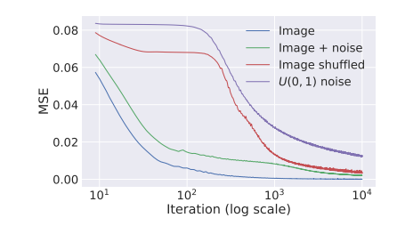
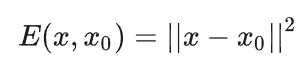
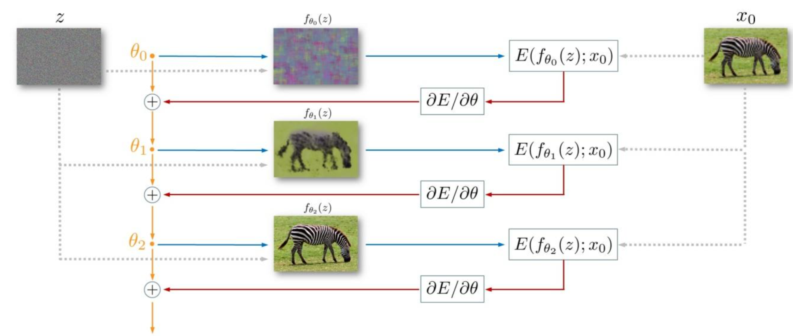
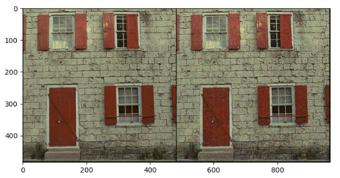
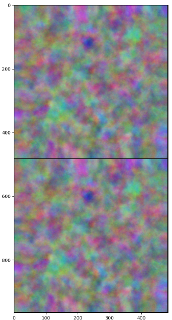
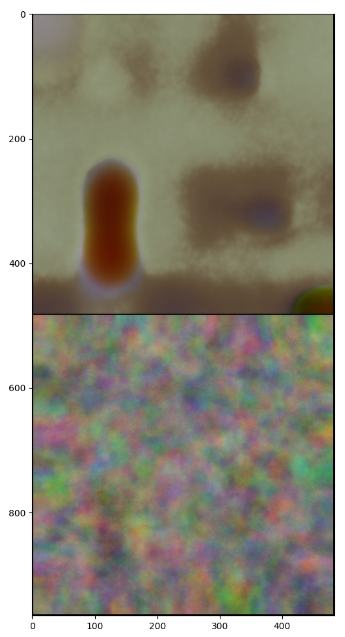
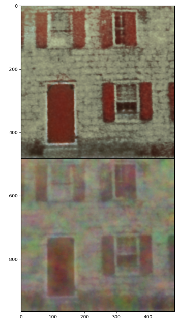
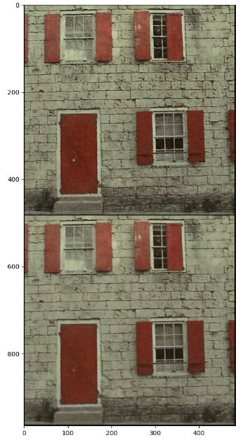
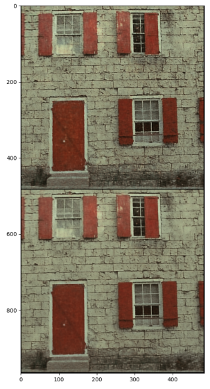

# DIP（Deep Image  Piror） 论文复现

## 一、论文原理

### 1.论文思想：神经网络的**噪声阻抗性** 

神经网络被证明可以拟合任何函数，这意味着理论上网络可以生成任何图片。

**DIP论文作者证明**：尽管神经网络确实可以拟合几乎所有的图片，但是网络能更容易，或者说更快地学习并拟合出自然的，有规律的图片；相比之下，网络学习那些带有不规则噪声，不自然的图片则会慢很多。


对于以下四种图像，作者进行了实际实验：

1）干净的自然图像

2）带噪声的自然图像

3）自然图像像素被打乱后的图像

4）白噪声图像



​	相同的神经网络对不同的数据进行恢复，如果是真实自然图片网络可以非常快地进行恢复，而对于噪声网络的恢复在迭代很多次之后才能恢复。这展现出一种网络结构的特性：**对信号具有低阻抗，而对随机噪声具有高阻抗。**

​	因此我们可以在训练过程中使用 early stopping方法，在迭代一定次数后得到的图片的信号信息。

**神经网络信号低阻抗、噪声高阻抗解释：**因为神经网络中卷积核的[权值共享](https://zhida.zhihu.com/search?q=权值共享&zhida_source=entity&is_preview=1)机制使其能够在输出上施加一种特定的stationary（平稳性），因此输出会天然地倾向于产生[自相似性](https://zhida.zhihu.com/search?q=自相似性&zhida_source=entity&is_preview=1)的规律pattern。

### 2.降噪应用

开局只有随机初始化的网络f，随机但是固定的输入z以及噪声图像 x0 作为学习的目标。可令数据项为:



具体的迭代优化过程如下：



使用固定的噪声编码z，使用梯度下降进行迭代，模型在迭代的过程中会逐渐展现原图像的模样。

**注意：**模型需要把握好迭代次数：

- 模型在迭代次数较少时，无法逼近原图像	

	- 在迭代次数适中时，模型可以学习到原图像的分布，还未来得及学习到噪声
	- 在迭代过多次数时，模型会发生过拟合，将噪声也一同进行学习到

### 3.发现问题

1. 速度慢，处理一个工作需要迭代上千次
2. 性能不稳定，对不同的噪声达到较好效果的迭代次数不同
3. 怎么确定终止次数是一个重要问题

### 4.论文总结

​	本文主要提供的思想是基于神经网络对低频和高频信息的不同学习阻抗，在以低频为主导的情况下，优先学习到低频分布，以此来过滤掉高频噪声。

## 二、论文复现

根据原论文的方法，我使用了Kodak24/kodim01.png的图像，添加σ = 25的高斯噪声进行复现。由于单图片训练时间较长，**因此只进行了单张图片的效果展示。**

配置参数如下所示：

```python
imsize = -1
PLOT = True
sigma = 25
sigma_ = sigma / 255.0
frame = "../../dataset/Kodak24/kodim01.png"
INPUT = 'noise' # 'meshgrid'
pad = 'reflection'
OPT_OVER = 'net' # 'net,input'

reg_noise_std = 1./30. # set to 1./20. for sigma=50
LR = 0.01

OPTIMIZER='adam' # 'LBFGS'
show_every = 10
exp_weight=0.99
num_iter = 3000
input_depth = 32 # 32
figsize = 4
out_avg = None
last_net = None
psrn_noisy_last = 0
```

#### iteration_0  



​																						左为原图像，右为噪声图像


#### iteration_1 注意：上为降噪模型直接输出图像，下为每次训练后与之前输出平滑后的图像



#### iteration_10



#### iteration_100



#### iteration_400



#### iteration_500



结论：通过迭代图像可以直接观察出，模型通过让随机噪声拟合原图像的过程中，图像轮廓由模糊变为清晰，并且在短期训练内模型并未学习到噪声分布，并且400 - 500轮迭代的图像从视觉角度清晰度较高,PSNR达到31。


